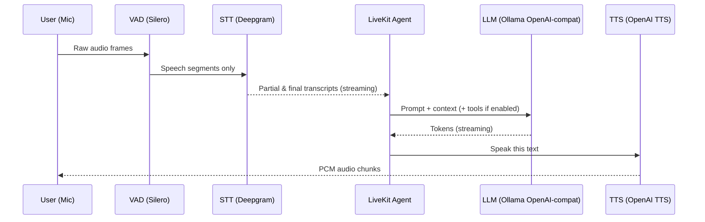

# Build a LiveKit Voice Tutor in 20 Minutes
Talk to a real‑time Aussie-flavoured voice AI, powered by local Ollama models, Deepgram speech-to-text, Silero VAD, and OpenAI TTS. This repo bundles ready-to-run agents plus practice tools so teens can learn, hack, and teach others.

## Demo at a glance
- Fire up `voice_livekit_agent/livekit_basic_agent.py` and chat in the console; toggle audio/text with `Ctrl+B`.
- Launch `voice_livekit_agent/french_voice_tutor.py` for quick French practice with level and roleplay switches.
- Upgrade to `voice_livekit_agent/french_voice_tutor_plus.py` for spaced-repetition quizzes, “what’s due today?” voice summaries, pronunciation hints, JSON/CSV exports, and a daily macOS reminder (`scripts/srs_daily.py`).

## Quickstart (copy, paste, run)
```bash
# 1) Model (local LLM via Ollama)
ollama pull llama3.2:3b
ollama serve   # keep running in another tab

# 2) Install Python deps (uv prefers pyproject.toml)
uv sync
# or, if you want the short form:
uv add "livekit-agents[openai]~=1.2" livekit-plugins-deepgram livekit-plugins-silero python-dotenv requests

# 3) .env (safe placeholders only)
cat > .env <<'EOF'
OPENAI_BASE_URL=http://127.0.0.1:11434/v1
OPENAI_API_KEY=ollama
LLM_MODEL=llama3.2:3b
LLM_TEMPERATURE=0.6
BASIC_TEST=true
WARMUP_LLM=true
WARMUP_TIMEOUT=60
# Voice mode
# DEEPGRAM_API_KEY=YOUR_DEEPGRAM_KEY
# OPENAI_TTS_API_KEY=YOUR_TTS_KEY
# TTS_VOICE=alloy
# USE_TOOLS=true
EOF
```

```bash
# Smoke test (LLM only path)
uv run python -m voice_livekit_agent.livekit_basic_agent console

# French tutor basics
uv run python -m voice_livekit_agent.french_voice_tutor console

# French tutor PLUS (quizzes, due words, pronunciation, exports)
uv run python -m voice_livekit_agent.french_voice_tutor_plus console

# Daily reminder script (CSV + macOS notification)
uv run python scripts/srs_daily.py
```

## Architecture deep-dive




## How it works under the hood (for curious teens)
- **VAD (Silero)** snips silence so Deepgram only hears real speech, cutting costs and latency.
- **Streaming STT (Deepgram Nova-2)** feeds partial transcripts to the agent; the console shows words as they land.
- **LiveKit Agent loop** glues STT, LLM, TTS, and `@function_tool`s together. When `USE_TOOLS=true`, methods like `due_words`, `start_quiz`, or `check_pronunciation` become callable from model responses.
- **LLM via Ollama** hits `http://127.0.0.1:11434/v1` through OpenAI-compatible APIs. `_warmup_ollama()` sends a tiny prompt so your first real reply doesn’t stall.
- **TTS (OpenAI)** streams MP3 chunks back. Short sentences give smoother speech, so replies stay snappy.
- **Latency tips:** keep VAD thresholds default, pick lighter models (`llama3.2:1b`) when you’re in a rush, and keep responses under two sentences.
- **Persistence:** tutor progress lives in `french_progress_plus.json` (see `SRS_STATE_FILE`); exports land in `~/.french_tutor/exports`.
- **Spaced repetition (Leitner boxes):** each vocab entry carries `box` (1–5) and `next_due`. Answer right → box bumps up and the next review drifts further away; miss it and you return to box 1.
- **`due_words` picker:** calls `_due_indices()` to grab overdue items, sorts by box, then reads the top few so you know what to revise.

```python
while session.active:
    frames = mic.read()
    if vad.is_speech(frames):
        stt.push(frames)
    partial = stt.get_partial()
    if partial:
        agent.ingest_transcript(partial)
    if agent.needs_reply():
        text = llm.complete(agent.context)
        audio = tts.speak(text)
        speaker.play(audio)
```

## Features mapped to files
- `voice_livekit_agent/livekit_basic_agent.py` – minimal LiveKit demo with optional tool toggle; great for smoke tests.
  - Try saying: “What’s the weather?” (LLM reply); toggle text/audio with `Ctrl+B`.
- `voice_livekit_agent/french_voice_tutor.py` – friendly tutor with CEFR levels, roleplays, phrase packs.
  - Commands: “set level B1”, “roleplay café”, “add vocab bonjour; hello”.
- `voice_livekit_agent/french_voice_tutor_plus.py` – everything above plus SRS quizzes, `due_words`, pronunciation checker, auto CSV/JSON exports.
  - Commands: “what’s due today?”, “start quiz 8 en2fr”, “give me a hotel sentence”, then speak it back.
- `scripts/smoke_test.py` – local LLM sanity check (no audio).
- `scripts/srs_daily.py` – prints due vocab and shows a macOS notification; wire it into `launchd` for your morning reminder.

## Environment variables
| Key | Default | Required? | Notes |
| --- | --- | --- | --- |
| `OPENAI_BASE_URL` | `http://127.0.0.1:11434/v1` | ✅ | Points the OpenAI client at Ollama. |
| `OPENAI_API_KEY` | `ollama` | ✅ | Ollama ignores the value but the header must exist. |
| `LLM_MODEL` | `llama3.2:3b` | ✅ | Any Ollama model slug; smaller models = faster. |
| `LLM_TEMPERATURE` | `0.6` | Optional | Lower for more deterministic responses. |
| `BASIC_TEST` | `true` | ✅ | When true, agents run a smoke test then exit. Flip to false for full voice mode. |
| `WARMUP_LLM` | `true` | Optional | Keeps the first real reply quick. |
| `WARMUP_TIMEOUT` | `60` | Optional | Timeout for the warm-up request. |
| `USE_TOOLS` | `false` | Optional | Turn on to let LLM call `@function_tool`s (recommended for tutors). |
| `DEEPGRAM_API_KEY` | — | Required when `BASIC_TEST=false` | Enables Deepgram STT. |
| `DEEPGRAM_MODEL` | `nova-2` | Optional | Switch to lighter models if bandwidth is tight. |
| `OPENAI_TTS_API_KEY` | — | Required when `BASIC_TEST=false` | Powers OpenAI TTS. |
| `TTS_VOICE` | `alloy` | Optional | Change to any supported voice. |
| `TTS_PROVIDER` | `deepgram` or `openai` | Optional | Swaps TTS backend; defaults to OpenAI. |
| `DEEPGRAM_TTS_MODEL` | `aura-2-andromeda-en` | Optional | Used when `TTS_PROVIDER=deepgram`. |
| `OPENAI_TTS_BASE_URL` | `https://api.openai.com/v1` | Optional | Forces TTS away from the Ollama base URL. |
| `SRS_STATE_FILE` | `french_progress_plus.json` | Optional | Where tutor progress is stored. |
| `SRS_EXPORT_DIR` | `~/.french_tutor/exports` | Optional | Export directory for CSV/JSON snapshots. |
| `SRS_AUTO_EXPORT` | `true` | Optional | Auto-export after vocab or quiz updates. |
| `SRS_EXPORT_FORMAT` | `csv` | Optional | `csv`, `json`, or `both`. |

**Never commit `.env`.** Use the supplied `.gitignore`, or in GitHub Codespaces run `gh secret set` to store keys securely.

## Run modes & controls
- `BASIC_TEST=true` → agents print “LLM CHECK OK …” and exit; flip to `false` for the full voice loop.
- `Ctrl+B` in LiveKit console toggles Text ↔ Audio so you can demo with or without speakers.
- Leave `WARMUP_LLM=true`; it preloads the Ollama model and slashes first-token latency.
- The `scripts/smoke_test.py` helper is perfect for CI or quick checks—no Deepgram/OpenAI keys needed.

## Learning features (tutor builds)
- **Roleplay** topics: café, travel, hotel. Ask: “roleplay travel” and the tutor acts the scene with a phrase bank.
- **Vocab quiz (SRS)**: “start quiz 5 en2fr” launches Leitner-box practice; answer out loud then hear feedback.
- **Due words**: “what’s due today?” reads the top items waiting for review, nudging you to quiz.
- **Pronunciation**: “give me a café sentence” → repeat it; the tutor compares transcripts and offers accent tips.
- **Exports + reminders**: snapshots land in `~/.french_tutor/exports`; schedule `scripts/srs_daily.py` with `launchd` to get a morning toast.

## Troubleshooting
- **Ollama model not found** → `ollama pull llama3.2:3b`.
- **Port already in use** → `lsof -i :11434` then restart `ollama serve`.
- **First response slow** → ensure `WARMUP_LLM=true` or manually run the tutor once before class.
- **Mic muted on macOS** → grant Terminal microphone access in System Settings → Privacy & Security → Microphone.
- **Missing Deepgram or TTS key** → errors show `Missing required environment variables`. Add them to `.env`.
- **No audio playback in console** → hit `Ctrl+B` to leave text-only mode; confirm your speakers aren’t muted.
- **Export folder permissions** → create it manually: `mkdir -p ~/.french_tutor/exports`.

## Performance & cost tips
- **Model size**: `llama3.2:3b` balances speed and quality. Drop to `llama3.2:1b` for faster replies with simpler language.
- **Sentence length**: shorter responses cut TTS lag. Encourage the tutor to keep answers to one or two sentences.
- **Streaming chunk size**: leave defaults; lowering Deepgram buffer can raise costs without big gains.
- **Silences**: long pauses still cost STT time—keep conversations brisk.
- **Alternative providers**: swap to `TTS_PROVIDER=deepgram` if OpenAI TTS hits quota.

## Safety, privacy, and educational use
- For educational purposes only—don’t feed personal addresses, exam answers, or real customer data.
- Audio streams go to Deepgram (STT) and your chosen TTS provider; text hits your local Ollama instance.
- `.env` stays local; secrets never touch git. If you demo online, rotate keys afterwards.
- Remind students to anonymise any shared vocab exports.

## For educators
- **45-minute lesson plan**  
  1. Quickstart commands (10 min).  
  2. Diagram the pipeline with the Mermaid charts (10 min).  
  3. Let teams customise prompts or add vocab (15 min).  
  4. Share reflections and latency hacks (10 min).
- **Glossary**  
  - *Token*: a tiny chunk of text the LLM reads/writes.  
  - *Latency*: time between speaking and hearing the reply.  
  - *Streaming*: sending data in pieces instead of one big blob.  
  - *VAD*: Voice Activity Detection—spots when someone’s talking.  
  - *STT*: Speech to Text—turns audio into words.  
  - *TTS*: Text to Speech—turns words back into audio.  
  - *Prompt*: the text instruction given to the LLM.  
  - *Tool call*: when the LLM triggers a Python function like `start_quiz`.

## License & credits
Credit to the LiveKit Agents team for the SDK, Deepgram for STT, Silero for VAD, Ollama for on-device LLMs, and OpenAI for TTS. Project organised and documented by Sam Kalaliya.
