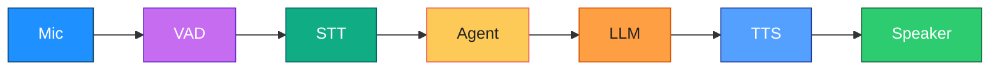

# Bonjour Mate – Your French Voice Tutor 🌞
Talk to a friendly French tutor right on your laptop. Practise speaking, get gentle hints, and learn real café, travel, and hotel phrases. Everything runs locally with an Ollama LLM, plus Deepgram speech-to-text and OpenAI text-to-speech when you enable voice mode.

## What you can do
- Chat mostly in French with clear English backup.
- Set your level (A1, A2, B1, B2, C1) whenever you like.
- Switch between chat, roleplay, quiz, explain, and pronunciation practice.
- Pull tiny phrase packs for café, travel, and hotel scenes.
- Save vocab, list it later, and hear which words are due for review.
- Run spaced-repetition quizzes and pronunciation checks (PLUS version).
- Auto-export progress to CSV/JSON and get a macOS daily reminder (PLUS + `scripts/srs_daily.py`).

## Quickstart (copy, paste, run)
```bash
# 1) Local model
ollama pull llama3.2:3b
ollama serve   # leave running in another terminal

# 2) Install Python deps
uv sync
# or, if you prefer a one-liner:
uv add "livekit-agents[openai]~=1.2" livekit-plugins-deepgram livekit-plugins-silero python-dotenv requests

# 3) Create .env (safe placeholders)
cat > .env <<'EOF'
OPENAI_BASE_URL=http://127.0.0.1:11434/v1
OPENAI_API_KEY=ollama
LLM_MODEL=llama3.2:3b
LLM_TEMPERATURE=0.6
BASIC_TEST=true
WARMUP_LLM=true
WARMUP_TIMEOUT=60
# Voice mode (flip BASIC_TEST=false to enable)
# DEEPGRAM_API_KEY=YOUR_DEEPGRAM_KEY
# OPENAI_TTS_API_KEY=YOUR_TTS_KEY
# TTS_VOICE=alloy
# USE_TOOLS=true
EOF
```

```bash
# Smoke test (LLM only, text replies)
uv run python -m voice_livekit_agent.french_voice_tutor console
# or go big with the PLUS features:
uv run python -m voice_livekit_agent.french_voice_tutor_plus console

# Voice mode: edit .env → BASIC_TEST=false, add STT/TTS keys, rerun the command above
```

## How it works (colour diagram)


- **VAD** listens for actual speech so we don’t waste time on silence.
- **STT** (Deepgram Nova-2) turns your voice into text.
- **Agent loop** (LiveKit) figures out context, tools, and corrections.
- **LLM via Ollama** provides natural French replies.
- **TTS** (OpenAI or Deepgram) speaks back with a friendly accent.

## Levels and modes (how to talk to it)
Say or type these commands while the tutor is listening:
- “set level B1” – switch difficulty.
- “switch mode roleplay café” / “roleplay travel” / “roleplay hotel”.
- “chat mode please” – return to normal conversation.
- “explain imparfait vs passé composé”.
- “add vocab bonjour, hello, example: bonjour tout le monde”.
- “what’s due today?” – hear the words ready for review.
- “start quiz 5 en2fr” – begin a 5-question English-to-French quiz.
- “answer: Je voudrais un café.” – respond to a quiz prompt.
- “give me a hotel sentence” – for pronunciation practice; repeat it back.

## Daily practice plan (15 minutes)
1. **3 min** warm-up chat: “Salut, comment ça va aujourd’hui ?”
2. **5 min** review “due words”: ask “what’s due today?” then run a quick quiz.
3. **5 min** roleplay: choose café or travel and improvise with the tutor.
4. **2 min** add two new vocab items with examples.

**Tip:** On macOS, schedule the reminder script after setting voice mode:
```bash
uv run python scripts/srs_daily.py          # test it
# then follow README.md to load ~/Library/LaunchAgents/com.sam.frenchtutor.daily.plist
```

## Cheat-sheet (handy French)
**Café**
- Bonjour, je voudrais un café s’il vous plaît. *(Hello, I’d like a coffee please.)*
- C’est à emporter ou sur place ? *(Takeaway or for here?)*
- Vous prenez la carte ? *(Do you take card?)*

**Travel**
- Où est la gare la plus proche ? *(Where is the nearest train station?)*
- À quelle heure part le prochain train pour Lyon ? *(When does the next train to Lyon leave?)*
- Je cherche un billet aller-retour. *(I’m looking for a return ticket.)*

**Hotel**
- J’ai une réservation au nom de Sam. *(I have a reservation under the name Sam.)*
- À partir de quelle heure est le check-in ? *(What time is check-in?)*
- Est-ce que le petit déjeuner est inclus ? *(Is breakfast included?)*

## Vocab & spaced repetition
Every word you add gets a “box” number and a “next due” date. When you answer correctly, the box climbs and the review time pushes further out. Miss it and it drops back to box 1. The “due words” tool reads out the ones waiting today. Auto-export (PLUS build) saves CSV/JSON snapshots in `~/.french_tutor/exports` so you can track progress or share with a teacher.

## Troubleshooting
- **Model not found** → `ollama pull llama3.2:3b`
- **First reply slow** → warm-up takes a moment; try again or keep the tutor running.
- **No sound** → check macOS mic permissions and tap `Ctrl+B` in the LiveKit console to toggle audio.
- **STT/TTS key missing** → add `DEEPGRAM_API_KEY` or `OPENAI_TTS_API_KEY` in `.env`.
- **Port already used** → restart `ollama serve` (or run `pkill ollama` then start it again).

## Safety, privacy, purpose
For educational use only. Don’t share personal details in your practice sentences. Keep `.env` private—never commit it. When voice mode is on, audio goes to Deepgram for transcription and text goes to your TTS provider.

## Credits
Built with LiveKit Agents, Deepgram STT, Silero VAD, Ollama LLMs, and OpenAI TTS. Project organised by Sam Kalaliya—merci et bon courage !
